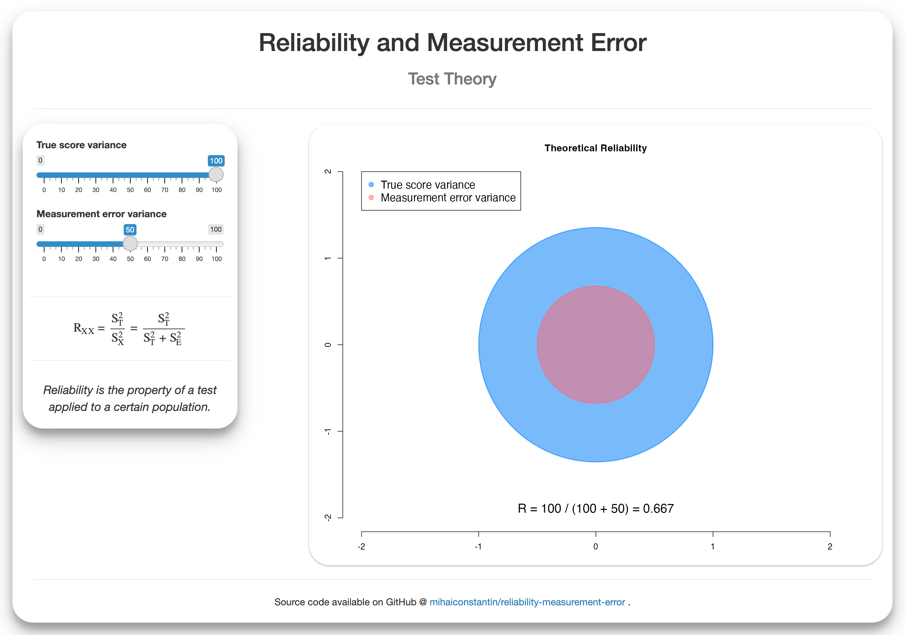

## Reliability and Measurement Error


### Description

A Shiny app used to illustrates the relationship between reliability and measurement error.
Developed for the Test Theory course at Tilburg University.

A live version of the application is hosted at: [https://mihaiconstantin.shinyapps.io/reliability-measurement-error](https://mihaiconstantin.shinyapps.io/reliability-measurement-error).



### Usage

To run the application locally:

```r
# Load library.
library(shiny)

# Run app.
runApp(".")
```

Note. If your application lives in a different folder (i.e., not the current working directory) you need to specify the path to that folder, e.g., `var/www/my-app`. Alternatively, you can set the working directory to that path and use `runApp(".")`.


### License

This app is licensed under the [GNU General Public License Version 2](https://www.gnu.org/licenses/old-licenses/gpl-2.0.txt). Please report any issues or bugs [here](https://github.com/mihaiconstantin/reliability-measurement-error/issues).
